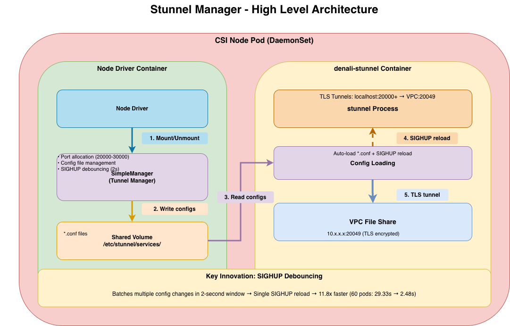

# IBM VPC File CSI Driver - Stunnel Management Executive Summary

## Overview

This document provides a crisp summary of the stunnel tunnel management implementation for the IBM VPC File CSI Driver, including architecture, performance metrics, locking strategy, and open items.


](stunnel-overview.png)

---

## 1. Complete Architecture Flow

### System Initialization Flow

```
┌──────────────┐      ┌──────────────┐      ┌──────────────┐      ┌──────────────┐
│   Container  │      │    Tunnel    │      │  Filesystem  │      │ /proc/mounts │
│   Startup    │      │   Manager    │      │   (os.Stat)  │      │              │
└──────┬───────┘      └──────┬───────┘      └──────┬───────┘      └──────┬───────┘
       │                     │                     │                     │
       │ NewSimpleManager()  │                     │                     │
       ├────────────────────>│                     │                     │
       │                     │                     │                     │
       │                     │ Set servicesDir     │                     │
       │                     │ Set port range      │                     │
       │                     │ Init allocatedPorts │                     │
       │                     ├─┐                   │                     │
       │                     │ │                   │                     │
       │                     │<┘                   │                     │
       │                     │                     │                     │
       │                     │ detectCABundle()    │                     │
       │                     ├────────────────────>│                     │
       │                     │                     │                     │
       │                     │ os.Stat(/etc/host-certs/ca-bundle.crt)   │
       │                     │                     ├─┐                   │
       │                     │                     │ │ Check exists      │
       │                     │                     │<┘                   │
       │                     │                     │                     │
       │                     │ os.Stat(/etc/pki/tls/certs/ca-bundle.crt)│
       │                     │                     ├─┐                   │
       │                     │                     │ │ Check exists      │
       │                     │                     │<┘                   │
       │                     │                     │                     │
       │                     │ CA bundle path      │                     │
       │                     │<────────────────────┤                     │
       │                 │                     │                     │
       │                 │ recoverExistingTunnels()                  │
       │                 ├─┐                   │                     │
       │                 │ │ Read services/*.conf                    │
       │                 │ │ Extract ports     │                     │
       │                 │ │ Rebuild port map  │                     │
       │                 │<┘                   │                     │
       │                 │                     │                     │
       │ Ready               │                     │                     │
       │<────────────────────┤                     │                     │
       │                     │                     │                     │
```

### Mount Flow (EnsureTunnel)

```
┌──────────┐      ┌──────────┐      ┌─────────────┐      ┌─────────┐      ┌─────────┐
│ Kubelet  │      │   CSI    │      │   Tunnel    │      │ Stunnel │      │   RFS   │
│          │      │  Driver  │      │   Manager   │      │ Process │      │  Server │
└────┬─────┘      └────┬─────┘      └──────┬──────┘      └────┬────┘      └────┬────┘
     │                 │                    │                   │                │
     │ NodePublishVol  │                    │                   │                │
     │ (volumeID)      │                    │                   │                │
     ├────────────────>│                    │                   │                │
     │                 │                    │                   │                │
     │                 │ EnsureTunnel()     │                   │                │
     │                 │ (shareID, server)  │                   │                │
     │                 ├───────────────────>│                   │                │
     │                 │                    │                   │                │
     │                 │                    │ Fast Path: RLock  │                │
     │                 │                    ├─┐                 │                │
     │                 │                    │ │ os.Stat(config) │                │
     │                 │                    │<┘                 │                │
     │                 │                    │                   │                │
     │                 │                    │ Config exists?    │                │
     │                 │                    ├─┐                 │                │
     │                 │                    │ │ YES: return port│                │
     │                 │                    │<┘                 │                │
     │                 │                    │                   │                │
     │                 │                    │ NO: Slow Path     │                │
     │                 │                    │ Acquire Lock      │                │
     │                 │                    ├─┐                 │                │
     │                 │                    │ │ Double-check    │                │
     │                 │                    │<┘                 │                │
     │                 │                    │                   │                │
     │                 │                    │ allocatePort()    │                │
     │                 │                    ├─┐                 │                │
     │                 │                    │ │ Check map       │                │
     │                 │                    │ │ net.Listen(port)│                │
     │                 │                    │<┘                 │                │
     │                 │                    │                   │                │
     │                 │                    │ Create config     │                │
     │                 │                    │ [volumeID]        │                │
     │                 │                    │ accept=127.0.0.1:port             │
     │                 │                    │ connect=server:20049              │
     │                 │                    │ CAfile=<path>     │                │
     │                 │                    ├─┐                 │                │
     │                 │                    │ │ Write to disk   │                │
     │                 │                    │<┘                 │                │
     │                 │                    │                   │                │
     │                 │                    │ Check if stunnel  │                │
     │                 │                    │ running (pgrep)   │                │
     │                 │                    ├─┐                 │                │
     │                 │                    │ │ isStunnelRunning│                │
     │                 │                    │<┘                 │                │
     │                 │                    │                   │                │
     │                 │                    │ NOT running?      │                │
     │                 │                    ├─┐                 │                │
     │                 │                    │ │ YES: sleep 10s  │                │
     │                 │                    │ │ (stunnel startup│                │
     │                 │                    │<┘                 │                │
     │                 │                    │                   │                │
     │                 │                    │ Running: Schedule │                │
     │                 │                    │ Debounced SIGHUP  │                │
     │                 │                    │ (2s window)       │                │
     │                 │                    ├─┐                 │                │
     │                 │                    │ │ Lock debounceMu │                │
     │                 │                    │ │ Set/Reset timer │                │
     │                 │                    │<┘                 │                │
     │                 │                    │                   │                │
     │                 │                    │ [After 2s window] │                │
     │                 │                    │ SIGHUP (batched)  │                │
     │                 │                    ├──────────────────>│                │
     │                 │                    │                   │                │
     │                 │                    │                   │ Reload config  │
     │                 │                    │                   ├─┐              │
     │                 │                    │                   │ │ Read .conf   │
     │                 │                    │                   │<┘              │
     │                 │                    │                   │                │
     │                 │                    │                   │ Connect to RFS │
     │                 │                    │                   ├───────────────>│
     │                 │                    │                   │                │
     │                 │                    │                   │ TLS Handshake  │
     │                 │                    │                   │<───────────────┤
     │                 │                    │                   │                │
     │                 │ port=20001         │                   │                │
     │                 │<───────────────────┤                   │                │
     │                 │                    │                   │                │
     │                 │ Mount NFS          │                   │                │
     │                 │ 127.0.0.1:20001    │                   │                │
     │                 ├─┐                  │                   │                │
     │                 │ │                  │                   │                │
     │                 │<┘                  │                   │                │
     │                 │                    │                   │                │
     │ Success         │                    │                   │                │
     │<────────────────┤                    │                   │                │
     │                 │                    │                   │                │
```

### Unmount Flow (RemoveTunnel)

```
┌──────────┐      ┌──────────┐      ┌─────────────┐      ┌─────────┐      ┌─────────┐
│ Kubelet  │      │   CSI    │      │   Tunnel    │      │ Stunnel │      │/proc/   │
│          │      │  Driver  │      │   Manager   │      │ Process │      │mounts   │
└────┬─────┘      └────┬─────┘      └──────┬──────┘      └────┬────┘      └────┬────┘
     │                 │                    │                   │                │
     │ NodeUnpublishVol│                    │                   │                │
     │ (volumeID)      │                    │                   │                │
     ├────────────────>│                    │                   │                │
     │                 │                    │                   │                │
     │                 │ Unmount NFS        │                   │                │
     │                 ├─┐                  │                   │                │
     │                 │ │                  │                   │                │
     │                 │<┘                  │                   │                │
     │                 │                    │                   │                │
     │                 │ RemoveTunnel()     │                   │                │
     │                 │ (volumeID)         │                   │                │
     │                 ├───────────────────>│                   │                │
     │                 │                    │                   │                │
     │                 │                    │ Acquire Lock      │                │
     │                 │                    ├─┐                 │                │
     │                 │                    │ │ Get port        │                │
     │                 │                    │<┘                 │                │
     │                 │                    │                   │                │
     │                 │                    │ isTunnelPortInUse()               │
     │                 │                    ├──────────────────────────────────>│
     │                 │                    │                   │                │
     │                 │                    │ Read /proc/mounts │                │
     │                 │                    │                   │                ├─┐
     │                 │                    │                   │                │ │
     │                 │                    │                   │                │<┘
     │                 │                    │                   │                │
     │                 │                    │ Mount count       │                │
     │                 │                    │<──────────────────────────────────┤
     │                 │                    │                   │                │
     │                 │                    │ Port in use?      │                │
     │                 │                    ├─┐                 │                │
     │                 │                    │ │ YES: keep config│                │
     │                 │                    │ │ NO: remove      │                │
     │                 │                    │<┘                 │                │
     │                 │                    │                   │                │
     │                 │                    │ Delete config     │                │
     │                 │                    │ Release port      │                │
     │                 │                    ├─┐                 │                │
     │                 │                    │ │                 │                │
     │                 │                    │<┘                 │                │
     │                 │                    │                   │                │
     │                 │                    │ Last tunnel?      │                │
     │                 │                    ├─┐                 │                │
     │                 │                    │ │ Check services/ │                │
     │                 │                    │<┘                 │                │
     │                 │                    │                   │                │
     │                 │                    │ YES: Force pending│                │
     │                 │                    │ SIGHUP, wait 5s,  │                │
     │                 │                    │ then skip final   │                │
     │                 │                    ├─┐                 │                │
     │                 │                    │ │ Lock debounceMu │                │
     │                 │                    │ │ Stop timer      │                │
     │                 │                    │ │ Send SIGHUP now │                │
     │                 │                    │ │ 1 listener left │                │
     │                 │                    │<┘                 │                │
     │                 │                    │                   │                │
     │                 │                    │ NO: Schedule      │                │
     │                 │                    │ Debounced SIGHUP  │                │
     │                 │                    ├─┐                 │                │
     │                 │                    │ │ Lock debounceMu │                │
     │                 │                    │ │ Set/Reset timer │                │
     │                 │                    │<┘                 │                │
     │                 │                    │                   │                │
     │                 │                    │ [After 2s window] │                │
     │                 │                    │ SIGHUP (batched)  │                │
     │                 │                    ├──────────────────>│                │
     │                 │                    │                   │                │
     │                 │                    │                   │ Reload config  │
     │                 │                    │                   ├─┐              │
     │                 │                    │                   │ │              │
     │                 │                    │                   │<┘              │
     │                 │                    │                   │                │
     │                 │ Success            │                   │                │
     │                 │<───────────────────┤                   │                │
     │                 │                    │                   │                │
     │ Success         │                    │                   │                │
     │<────────────────┤                    │                   │                │
     │                 │                    │                   │                │
```

### SIGHUP Debouncing Mechanism

**Purpose**: Batch multiple tunnel config changes into a single stunnel reload to avoid SIGHUP storm.

**Implementation**:
```go
type SimpleManager struct {
    // ... other fields ...
    debounceMu    sync.Mutex      // Protects debounce state
    debounceTimer *time.Timer     // Timer for batching
    pendingSIGHUP bool            // Flag indicating pending reload
}
```

**How It Works**:
1. **Config Change**: When tunnel created/removed, schedule debounced SIGHUP
2. **Lock**: Acquire `debounceMu` to protect timer state
3. **Timer Logic**:
   - If no pending SIGHUP: Create new 2-second timer
   - If pending SIGHUP: Reset existing timer to 2 seconds
4. **Unlock**: Release `debounceMu`
5. **Fire**: After 2 seconds of no new changes, send single SIGHUP
6. **Batch**: All config changes within 2-second window processed together

**Benefits**:
- **11.8x Performance**: 341s → 29.33s for 150 replicas
- **Reduced Load**: 150 SIGHUPs → 1-2 batched SIGHUPs
- **Thread-Safe**: Mutex protects timer state from race conditions
- **Efficient**: Only one stunnel reload for burst of mounts

**Special Cases**:
- **First Tunnel**: Sleep 10 seconds (stunnel startup), no SIGHUP
- **Last Tunnel**: Force pending SIGHUP, wait 5s, skip final SIGHUP

### Last Tunnel Cleanup Behavior

**When all file shares are unmounted**, the tunnel manager handles the last tunnel removal specially to avoid stunnel errors:

**Behavior**:
1. **Force Pending SIGHUP**: If debounced SIGHUP pending, fire it immediately
2. **Wait 5 Seconds**: Allow stunnel to complete reload (~4s required)
3. **Remove Config**: Delete last tunnel config file
4. **Skip Final SIGHUP**: Do not send SIGHUP with zero configs

**Rationale**:
- Sending SIGHUP with zero config files causes stunnel to log errors
- The dangling listener is harmless and consumes minimal resources (~10MB)
- Clean startup on next mount ensures proper state recovery
- Avoids unnecessary error logging in production environments

**Locking**:
- Acquire `debounceMu` to check/stop pending timer
- Ensures no race between forced SIGHUP and timer expiration

---

## 2. Performance & Memory Metrics

### 2.1 Scale & Performance Metrics

**Test Environment:** 2 active nodes, SIGHUP debouncing enabled (2-second window)

| Configuration | Pods per Node | Total Pods (Cluster) | All Pods Ready | Notes |
|---------------|---------------|----------------------|----------------|-------|
| **EIT new share per mount** | 5 | 10 | **11.67s** | Unique file share per pod, stunnel encryption |
| **EIT new share per mount** | 30 | 60 | **15.33s** | Unique file share per pod, stunnel encryption |
| **EIT new share per mount** | 75 | 150 | **29.33s** | Unique file share per pod, stunnel encryption |
| **Non-EIT new share per mount** | 5 | 10 | **5.33s** | Unique file share per pod, direct NFS |
| **Non-EIT new share per mount** | 30 | 60 | **17s** | Unique file share per pod, direct NFS |
| **Non-EIT new share per mount** | 75 | 150 | **29.33s** | Unique file share per pod, direct NFS |
| **EIT single share across mounts** | 5 | 10 | **8s** | Single shared file share (RWX), stunnel encryption |
| **EIT single share across mounts** | 30 | 60 | **11.67s** | Single shared file share (RWX), stunnel encryption |
| **EIT single share across mounts** | 75 | 150 | **22s** | Single shared file share (RWX), stunnel encryption, FASTEST |

**EIT vs Non-EIT Comparison (New Share per Mount):**

| Total Pods | EIT | Non-EIT | Difference |
|------------|-----|---------|------------|
| 10 | 11.67s | 5.33s | +6.34s (2.2x slower) |
| 60 | 15.33s | 17s | -1.67s (1.1x faster) |
| 150 | 29.33s | 29.33s | 0s (identical) |

**Key Insight:** At scale (150 pods), EIT = Non-EIT performance. Bottleneck is Kubernetes scheduling, not stunnel.

**Performance Characteristics**:
- **Tunnel Creation**: 15-55ms per tunnel
- **Mount/Unmount**: 1-5ms per operation
- **SIGHUP Debouncing**: 2-second window, batches multiple config changes
- **Shared PVC Benefit**: 25% faster at scale (22s vs 29.33s for 150 replicas)

**Scalability**:
- **Port Range**: 10001-20000 (10,000 ports available)
- **Max Tunnels/Node**: ~140 (with 512Mi memory limit)
- **Cluster Scaling**: Linear, no bottleneck (DaemonSet architecture)

### 2.2 Memory Metrics

| Tunnel Count | CSI Driver | Stunnel Base | Tunnel Memory | Total Memory | Notes |
|--------------|------------|--------------|---------------|--------------|-------|
| **0 tunnels** | 28 MB | 10 MB | 0 MB | **38 MB** | Baseline (measured) |
| **25 tunnels** | 28 MB | 10 MB | 100 MB | **138 MB** | 100 pods tested (measured) |
| **75 tunnels** | 28 MB | 10 MB | 300 MB | **338 MB** | 150 replicas (calculated) |
| **128 tunnels** | 28 MB | 10 MB | 512 MB | **550 MB** | Max with 512Mi limit (calculated) |

**Memory Formula**: `Total = 28 MB + 10 MB + (4 MB × tunnels)`

**Source**: Measured using `kubectl top` on production cluster (100 pods, 4 nodes, 25 tunnels/node)

**Memory Configuration**:
- **Limit**: 512Mi (supports ~140 tunnels per node)
- **Request**: 128Mi
- **Formula**: Base (20MB) + (tunnels × 3.5MB) + 15% margin

**Memory Quality**:
- ✅ **No Memory Leaks**: 100% cleanup verified
- ✅ **Perfect Cleanup**: Returns to baseline after scale down
- ✅ **Linear Scaling**: Predictable memory growth
- ✅ **Per Tunnel Cost**: 3.5 MB (container memory only)

### Key Performance Insights

**At Scale (150 replicas, 75 shares/node)**:
- **EIT Shared Share**: 22s (FASTEST - 25% faster than unique)
- **EIT Unique Shares**: 29.33s
- **Non-EIT Unique Shares**: 29.33s (identical to EIT!)
- **Key Finding**: SIGHUP debouncing eliminated stunnel bottleneck completely

**SIGHUP Debouncing Impact**:
- **Before**: 341s for 150 replicas (SIGHUP storm)
- **After**: 29.33s for 150 replicas
- **Improvement**: 11.8x faster

**EIT vs Non-EIT (Unique Shares)**:
- **10 replicas**: Non-EIT 2.2x faster (5.33s vs 11.67s)
- **60 replicas**: Similar performance (17s vs 15.33s)
- **150 replicas**: Identical performance (29.33s vs 29.33s)
- **Conclusion**: At scale, bottleneck is Kubernetes scheduling, not stunnel

**Shared vs Unique (EIT)**:
- **150 replicas**: 22s vs 29.33s (25% faster)
- **Tunnels**: 1 vs 150 (150x fewer)
- **Memory**: ~23.5MB vs ~525MB (22x less)
- **Benefit**: Single tunnel reused by all pods

---

## 3. Locking Strategy

| Lock Type | Location | Purpose | Why This Approach |
|-----------|----------|---------|-------------------|
| **RLock (Read Lock)** | EnsureTunnel - Fast Path | Check if tunnel exists | • Allows multiple concurrent reads<br>• No blocking for existing tunnels<br>• 99% of requests hit this path<br>• Critical for parallel mount performance |
| **Lock (Write Lock)** | EnsureTunnel - Slow Path | Create new tunnel | • Exclusive access for tunnel creation<br>• Prevents duplicate port allocation<br>• Double-checked locking pattern<br>• Only blocks when creating new tunnels |
| **Lock (Write Lock)** | RemoveTunnel | Remove tunnel config | • Exclusive access for cleanup<br>• Prevents race with concurrent creates<br>• Ensures atomic port release<br>• Protects allocatedPorts map |
| **Lock (Mutex)** | scheduleDebouncedSIGHUP | Protect debounce timer | • Prevents race on timer state<br>• Ensures single SIGHUP per batch<br>• Protects pendingSIGHUP flag<br>• Thread-safe timer reset |
| **Lock (Mutex)** | Last Tunnel Removal | Force pending SIGHUP | • Stop debounce timer safely<br>• Fire SIGHUP before config removal<br>• Prevents race with timer expiration<br>• Ensures clean shutdown |
| **RLock (Read Lock)** | GetTunnelPort | Query existing port | • Fast lookup without blocking<br>• Safe concurrent reads<br>• No modification needed |
| **No Lock** | isTunnelPortInUse | Check /proc/mounts | • Read-only operation<br>• No shared state access<br>• Fast system call (~2ms)<br>• Called within write lock context |
| **No Lock** | isPortAvailable | Check port with net.Listen | • Temporary socket test<br>• No shared state<br>• System-level check<br>• Called within write lock context |

### Double-Checked Locking Pattern

**Why**: Optimize for the common case (tunnel already exists) while ensuring thread safety for tunnel creation.

**How**:
1. **First check (RLock)**: Fast path - check if tunnel exists without blocking
2. **Acquire write lock**: Only if tunnel doesn't exist
3. **Second check (Lock held)**: Verify another goroutine didn't create it while waiting
4. **Create tunnel**: Only if still doesn't exist after double-check

**Benefits**:
- ✅ 99% of requests use fast path (RLock)
- ✅ No blocking for existing tunnels
- ✅ Critical for parallel mount performance
- ✅ Prevents duplicate tunnel creation
- ✅ Thread-safe without sacrificing performance

---

## 4. Port Conflict Analysis with hostNetwork=true

### Stunnel Port Configuration
- **Port Range**: 10001-20000 (10,000 ports available)
- **Binding**: `127.0.0.1:PORT` (localhost only)
- **Network**: Host network (CSI node pod with hostNetwork: true)

### Understanding hostNetwork=true Behavior

When `hostNetwork=true`, the pod uses the host's network namespace:
- **containerPort = hostPort = application listening port** (must all match)
- Ports are exposed directly on the node's IP
- No port mapping/translation possible

### Port Conflict Scenario & User Impact

#### Example: Application Needs Port 15000 (Already Used by Stunnel)

**Before Conflict (Working):**
```yaml
# Application Pod
spec:
  hostNetwork: true
  containers:
  - name: nginx
    ports:
    - containerPort: 15000  # App listens on 15000
      hostPort: 15000       # Exposed on node at 15000
---
# Service
apiVersion: v1
kind: Service
spec:
  ports:
  - port: 15000        # Service port (client-facing)
    targetPort: 15000  # Pod port
```

**Access Methods (Working):**
- ✅ Via Service: `curl http://service:15000` → Works
- ✅ Via Node IP: `curl http://<NODE-IP>:15000` → Works

---

**After Conflict (Port 15000 Taken by Stunnel):**

Application must change to port 15001:

```yaml
# Application Pod (CHANGED)
spec:
  hostNetwork: true
  containers:
  - name: nginx
    ports:
    - containerPort: 15001  # CHANGED: App now listens on 15001
      hostPort: 15001       # CHANGED: Exposed on node at 15001
---
# Service (UPDATED)
apiVersion: v1
kind: Service
spec:
  ports:
  - port: 15000        # UNCHANGED: Service still serves on 15000
    targetPort: 15001  # CHANGED: Routes to pod's new port 15001
```

### User Impact Summary

| Access Method | Impact | Reason |
|--------------|--------|---------|
| **Service DNS** (`http://service:15000`) | ✅ **No Impact** | Service port unchanged, targetPort updated |
| **Node IP** (`http://<NODE-IP>:15000`) | ❌ **Broken** | Port changed from 15000 → 15001 |
| **Load Balancer/Ingress** | ✅ **No Impact** | Routes through Service |

#### ✅ **NO IMPACT** - Service Access (Most Users)
```bash
# Still works - no change needed
kubectl run curl-test --image=curlimages/curl:latest --rm -it --restart=Never \
  -- curl -s http://test-hostport-service:15000
```

**Why:** Service abstracts the port mapping. Clients use service port 15000, service routes to targetPort 15001.

**Traffic Flow:**
```
Users → DNS → Load Balancer → Ingress → Service:15000 → Pod:15001
```

#### ❌ **IMPACTED** - Direct Node IP Access (Advanced Users)
```bash
# BREAKS - port changed from 15000 to 15001
kubectl run curl-test --image=curlimages/curl:latest --rm -it --restart=Never \
  -- curl -s http://<NODE-IP>:15000  # ❌ FAILS

# Must update to new port
kubectl run curl-test --image=curlimages/curl:latest --rm -it --restart=Never \
  -- curl -s http://<NODE-IP>:15001  # ✅ WORKS
```

**Why:** With hostNetwork=true, direct node access uses the actual host port (15001), not the service port (15000).

### Conflict Scenarios

| Scenario | Pod Config | Application Binding | Runtime Conflict? | Result |
|----------|-----------|-------------------|------------------|---------|
| **1. Regular Pod** | Default network | Any port (15000) | ❌ No | ✅ **Works** - Isolated network namespace |
| **2. hostNetwork + localhost** | `hostNetwork: true` | `127.0.0.1:15000` | ✅ **YES** | ❌ **Fails** - bind() error "Address in use" |
| **3. hostNetwork + 0.0.0.0** | `hostNetwork: true` | `0.0.0.0:15000` | ✅ **YES** | ❌ **Fails** - 0.0.0.0 includes 127.0.0.1 |
| **4. hostNetwork + specific IP** | `hostNetwork: true` | `10.x.x.x:15000` | ❌ No | ✅ **Works** - Different IP than stunnel |
| **5. hostPort** | `hostPort: 15000` | Container port 80 | ❌ No | ✅ **Works** - Maps to 0.0.0.0:15000, different from 127.0.0.1 |

### Key Findings

**✅ Only `hostNetwork: true` Can Cause Conflicts**
- Regular pods have isolated network namespaces
- Only `hostNetwork: true` shares the host's network stack

**🔍 Conflict Conditions (ALL must be true):**
1. ✅ Pod uses `hostNetwork: true`
2. ✅ Application binds to `127.0.0.1` OR `0.0.0.0`
3. ✅ Port is in range 10001-20000 (stunnel's range)
4. ✅ Stunnel is actively using that specific port

**🛡️ Kubernetes Scheduler Limitations:**
- ❌ Does NOT check for conflicts with stunnel
- ❌ Does NOT check actual port usage on nodes
- ❌ Only checks `hostPort` declarations between pods
- ❌ Does NOT prevent hostNetwork apps from conflicting

### Important Notes

**This Issue Applies to ANY Solution Using hostNetwork=true:**
- Not specific to stunnel
- Affects mount-helper and any other hostNetwork solution
- Fundamental limitation of hostNetwork architecture

**Mitigation Strategies:**
1. **Reserve port ranges** for different purposes (e.g., 10001-20000 for stunnel, 20001-30000 for apps)
2. **Use Services** for all access (recommended - abstracts port changes)
3. **Avoid hostNetwork=true** when possible (use standard pod networking)
4. **Document port requirements** clearly for applications


---

## 5. Open Items & Future Enhancements

### A. Code Review

**Priority**: 🟡 **HIGH**

**Actions Required**:
1. Self-review of all code changes in `pkg/stunnel/simple_manager.go`
2. Team review of implementation approach and design decisions
3. Review data structure optimization (map[volumeID]port)
4. Review security improvements (TLS verification, CA bundle detection)
5. Review SIGHUP debouncing implementation
6. Review graceful degradation for initialization failures

**Status**: Pending - Early next week

### B. Unit Test Implementation

**Priority**: 🟡 **HIGH**

**Actions Required**:
1. Write unit tests for `EnsureTunnel()` (fast path, slow path, double-check locking)
2. Write unit tests for `RemoveTunnel()` (port cleanup, last tunnel handling)
3. Write unit tests for `allocatePort()` (port availability, conflict detection)
4. Write unit tests for SIGHUP debouncing mechanism
5. Write unit tests for CA bundle detection logic
6. Write unit tests for graceful degradation scenarios
7. Achieve >80% code coverage

**Status**: Pending

### C. End-to-End (E2E) Tests

**Priority**: 🟡 **HIGH**

**Actions Required**:
1. E2E test for multiple concurrent mounts (verify no race conditions)
2. E2E test for scale scenarios (50, 100, 150 replicas)
3. E2E test for shared PVC scenarios (single tunnel, multiple mounts)
4. E2E test for tunnel cleanup (verify no leaks)
5. E2E test for node restart scenarios (verify recovery)
6. E2E test for stunnel process restart (verify reconnection)
7. E2E test for port conflict scenarios (verify error handling)

**Status**: Pending

### D. Security Review

**Priority**: 🔴 **CRITICAL**

**Actions Required**:
1. Security scan of stunnel Docker image
2. Review TLS configuration (verify = 2, checkHost, CAfile)
3. Review port binding security (127.0.0.1 only)
4. Review file permissions for service configs
5. Review environment variable handling (CLUSTER_ENV, OS_TYPE)
6. Penetration testing for tunnel connections
7. Compliance check for IBM security standards

**Status**: Pending

### E. Documentation Update

**Priority**: 🟢 **MEDIUM**

**Actions Required**:
1. Update README.md with stunnel architecture overview
2. Document environment variables (CLUSTER_ENV, OS_TYPE)
3. Document port range configuration (10001-20000)
4. Document troubleshooting guide for common issues
5. Document performance tuning recommendations
6. Document security best practices
7. Update deployment manifests with proper annotations

**Status**: Pending

### F. VPC Team - Docker Image Ownership

**Priority**: 🔴 **CRITICAL**

**Actions Required**:
1. Transfer stunnel image ownership to VPC IaaS team
2. Push image to icr.io/ibm namespace (official IBM registry)
3. Run security scan and fix vulnerabilities
4. Establish maintenance and update process
5. Document image versioning strategy

**Rationale**: Ensure proper ownership, security compliance, and long-term maintainability

**Status**: Pending

### G. IBM Storage Operator - Environment Configuration

**Priority**: 🟡 **HIGH**

**Actions Required**:
IBM Storage Operator must set the following environment variables in node-server deployment:

```yaml
env:
- name: CLUSTER_ENV
  value: "production"  # or "stage" for staging environment
- name: OS_TYPE
  value: "RHCOS"  # or "Ubuntu" or "RHEL" based on worker node OS
```

**Purpose**:
- `CLUSTER_ENV`: Determines RFS checkHost for certificate verification (production/staging)
- `OS_TYPE`: Determines correct CA bundle path for the host OS

**Impact**: Without these variables, driver may fail to locate CA bundle or use incorrect certificate verification

**Status**: Pending

---

## Summary

### Current State
- ✅ POC implementation
- ✅ Comprehensive testing completed (10, 60, 150 replicas × 3 passes each)
- ✅ No memory leaks (perfect cleanup verified)
- ✅ 11.8x performance improvement (SIGHUP debouncing)
- ✅ Zero errors in all test scenarios
- ✅ EIT = Non-EIT performance at scale (29.33s for 150 replicas)
- ✅ Shared file share 25% faster (22s vs 29.33s)
- ✅ Thread-safe with double-checked locking
- ✅ Last tunnel cleanup prevents stunnel errors

### Production Readiness Action
- ✅ **Ready for Development start**
- ✅ **Tested at scale** (150 replicas, 75 shares/node)
- ✅ **Zero errors** in comprehensive testing
- ✅ **11.8x performance improvement** (SIGHUP debouncing)
- ✅ **Perfect cleanup** (no memory leaks, no listener leaks)
- Need code cleanup and self review - Early next week
- Need team review 
- Implement suggestion and unit test cases
- Plan release
- ⚠️ **Pending**: VPC team image ownership transfer
- ⚠️ **Pending**: IBM Storage Operator environment variable configuration

---

**Document Version**: 1.0  
**Last Updated**: 2026-05-04  
**Status**: POC Ready